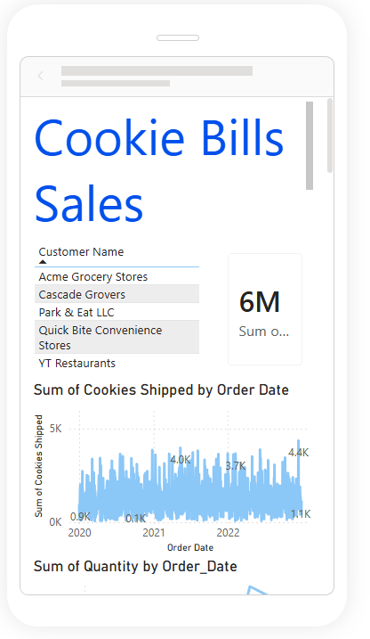
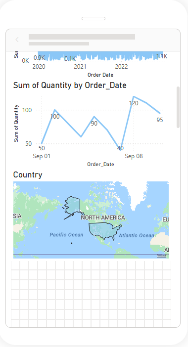
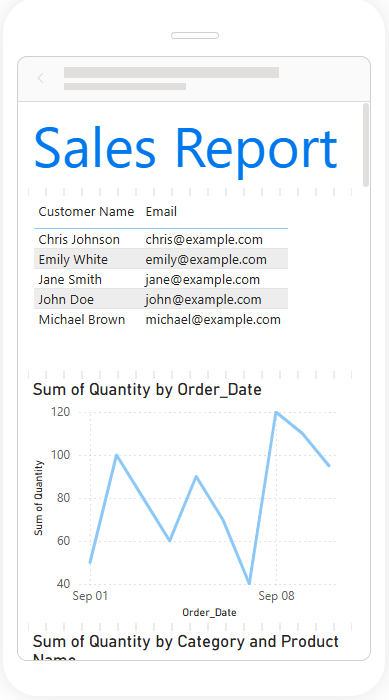
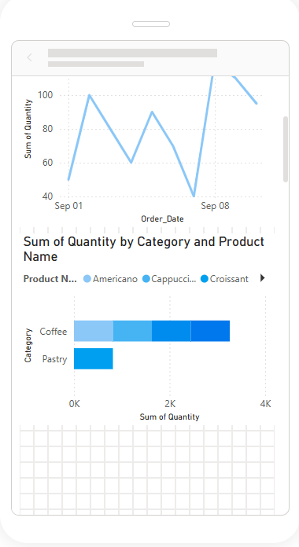
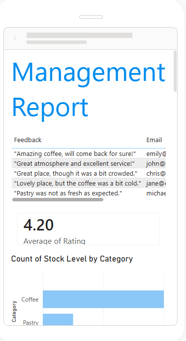
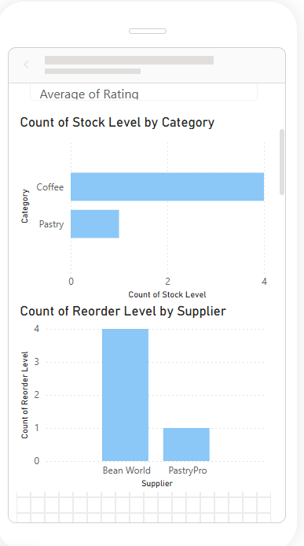
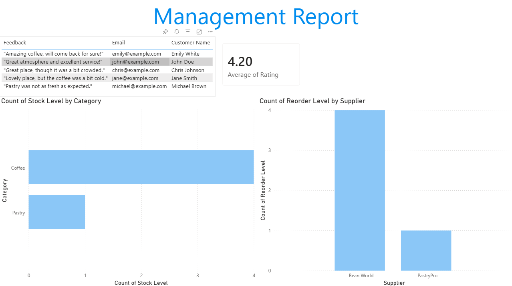
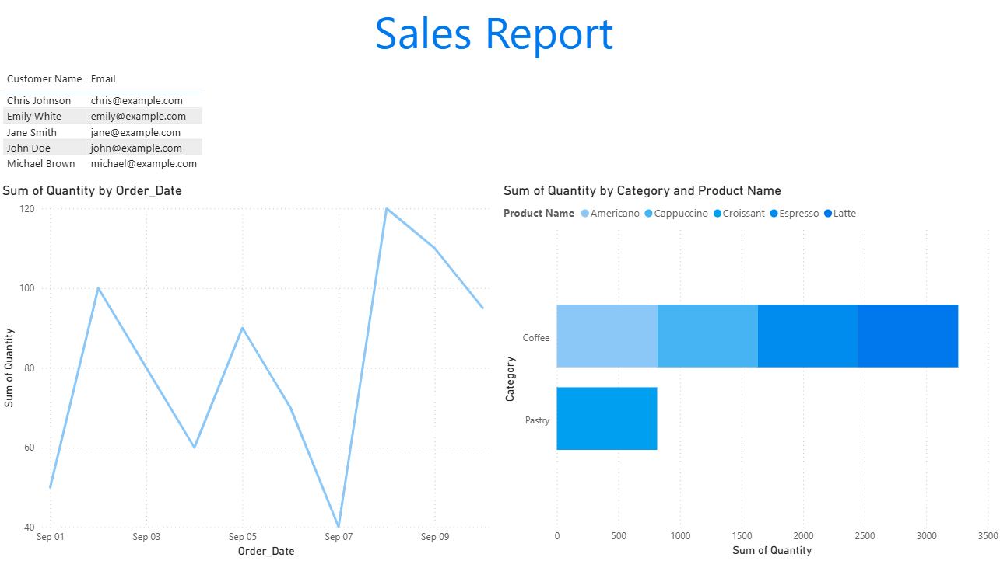
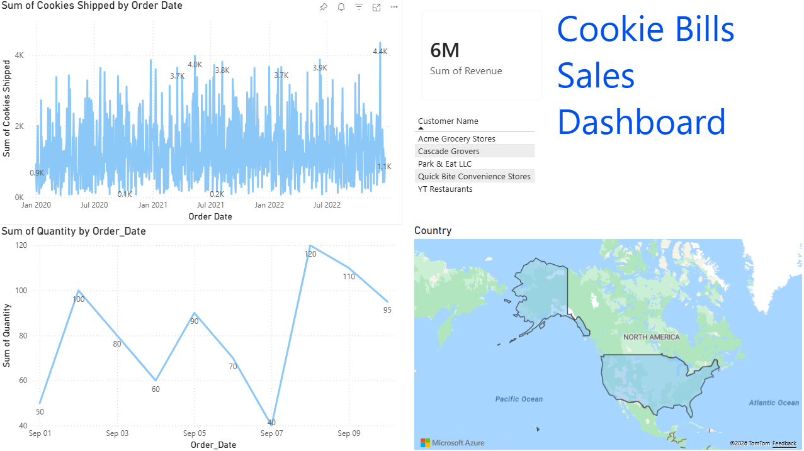

# Cookie Sales Analytics Dashboard | Power BI

A business intelligence project that combines multiple Excel datasets into a relational Power BI model for sales, cost, order, inventory, customer and feedback analysis.

## Business Objective

Create an executive-friendly reporting solution that supports desktop and mobile users, allows interactive exploration and presents operational performance across three report pages.

## Data Sources

The repository includes three Excel workbooks under `Datasets/`. The Power BI model uses business data covering orders, customers, products, inventory and customer feedback.

## Work Completed

- Imported and transformed Excel data with Power Query.
- Created relationships between business tables.
- Built KPI cards, charts, tables, slicers and drill-down interactions.
- Developed three report pages:
  - Cookie Bills Sales Dashboard
  - Sales Report
  - Management Report
- Added cross-filtering, cross-highlighting and page navigation.
- Designed a dedicated mobile layout.
- Prepared the report for Power BI Service distribution.

## Technologies

- Microsoft Power BI Desktop
- Microsoft Excel
- Power Query
- Data modeling
- Interactive data visualization

## Repository Structure

```text
Retail-Sales-Analytics-Dashboard/
├── Projecta.pbix
├── Datasets/
│   ├── data.xlsx
│   ├── practice.xlsx
│   └── final.xlsx
├── screenshots/
│   ├── first.png
│   ├── second.png
│   ├── third.png
│   ├── fourth.png
│   ├── fifth.png
│   ├── sixth.png
│   ├── seventh.png
│   ├── eighth.png
│   └── ninth.png
└── README.md
```

## Dashboard Preview

### View 1


### View 2


### View 3


### View 4


### View 5


### View 6


### View 7


### View 8


### View 9


## Skills Demonstrated

- Power Query data preparation
- Relational data modeling
- KPI and dashboard design
- Interactive filtering and drill-down
- Desktop and mobile report design
- Business reporting with Power BI

## Notes

The `.pbix` file and source workbooks are included for review. The README now reflects the actual filenames and folder structure in the repository rather than placeholder paths.
